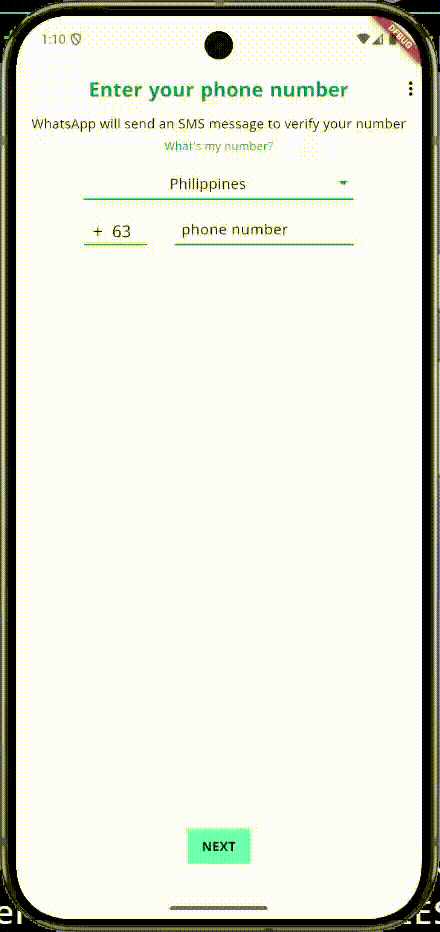
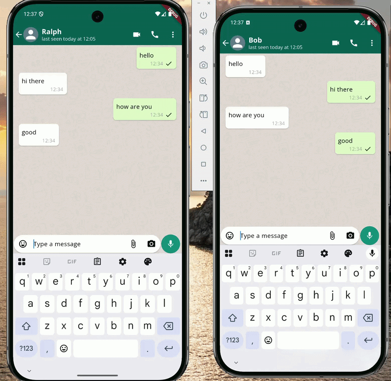

# WhatsApp Clone (Flutter + Node.js + TypeScript + Socket.IO)

A chat app built with Flutter and a Node.js (TypeScript) backend using Socket.IO for real-time messaging.  
Authentication uses firebase Phone OTP verification, and the server also supports image messaging/uploads.

---

## Repositories

- **Frontend:** https://github.com/romelt777/ChatApp 
- **Backend:** https://github.com/romelt777/chat-app-server  

---

## Screenshots/Gifs

  
  

---

## Tech Stack

### Client
- Flutter (Dart)
- Firebase Auth (Phone OTP)

### Server
- Node.js
- TypeScript
- Socket.IO
- Image upload handling (multer)

---

## Quick Set Up

### Client 
1. Clone repo:
> clone https://github.com/romelt777/ChatApp
2. Install packages:
> flutter pub get
3. Run App:
> flutter run

### Server
1. clone repo:
> https://github.com/romelt777/chat-app-server
2. run server
> npm run dev

---
